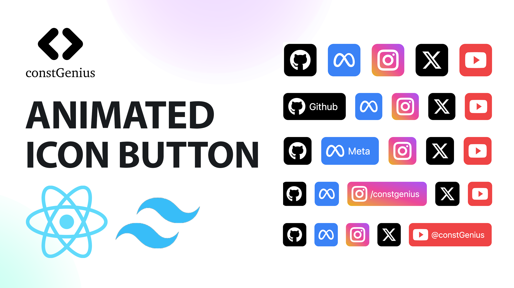

# Animated Icon Button in React and Tailwind CSS | Animated Icon Button Component in ReactJS

The Animated Icon Button in React and Tailwind CSS is a sleek UI component that presents a concise icon, expanding gracefully to reveal accompanying text upon user hover. With a perfect blend of React's dynamic components and Tailwind CSS's utility-first styling, this button seamlessly combines visual elegance with user interaction. The component delivers a modern and space-efficient solution, providing an engaging experience where users can effortlessly explore and understand the purpose behind each icon by simply hovering over them.

Youtube Tutorial Link: https://youtu.be/VkE8KDfXu7I

